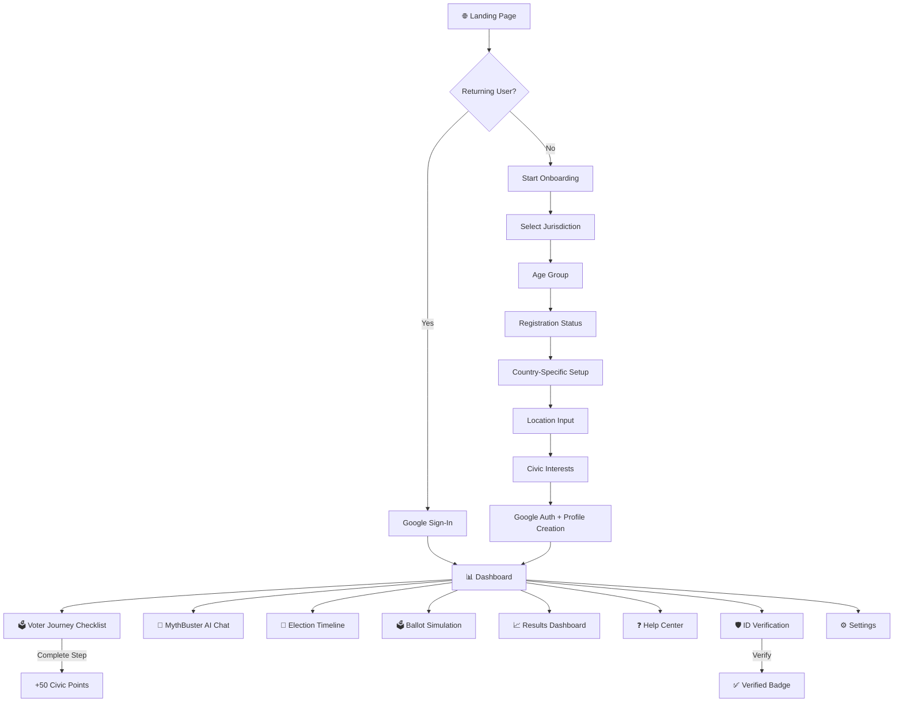
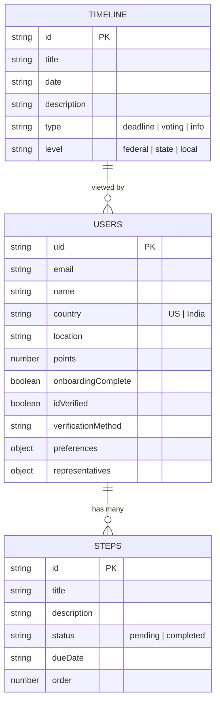

<p align="center">
  
</p>


<h1 align="center">🗳️ CivicTrust — Secure Your Vote. Track Your Impact.</h1>

<p align="center">
  <strong>AI-Powered Voter Assistance Portal for the 2026 Election Cycle</strong>
</p>

<p align="center">
  Built with React • TypeScript • Firebase • Gemini AI • Tailwind CSS • Cloud Run
</p>

---

<p align="center">
  
  
  
  
  
  
</p>

<p align="center">
  <a href="https://civictrust-735054811257.us-central1.run.app">
    
  </a>
</p>

---

## 🧠 What is CivicTrust?

**CivicTrust is an AI-powered voter companion** that guides citizens through every step of the election journey — from registration to results.

It removes confusion, fights misinformation, and helps people **actually participate in democracy with confidence.**


---

## ⚡ Why CivicTrust

🗳️ Personalized Voter Guide &nbsp;&nbsp;

•&nbsp;&nbsp; 🛡️ ID Verification &nbsp;&nbsp;

•&nbsp;&nbsp; 🤖 AI Myth-Buster &nbsp;&nbsp;

•&nbsp;&nbsp; 📅 Election Timeline &nbsp;&nbsp;

•&nbsp;&nbsp; 📊 Live Results Dashboard

---

## 🎥 Project Preview

<h2 align="center">📸 Product Preview</h2>

<p align="center">
  
</p>

<p align="center">
  
  
</p>

<p align="center">
  
</p>


---

## ⚖️ Overview

**CivicTrust** is a full-stack, AI-powered voter assistance platform designed to guide citizens through every stage of the democratic process — from voter registration verification to casting their ballot. Built as a single-page React application with a TypeScript Express backend, it supports multi-jurisdiction workflows for **India** and the **United States**.

**Target users:** First-time voters, senior citizens, civic organizations, and anyone who wants a clear, trustworthy guide through election season.

---

## ⚡ Why This Project Exists

Modern elections have a serious usability problem:

- People **miss deadlines**
- First-time voters feel **lost**
- Misinformation spreads faster than facts
- Critical information is **fragmented across websites**

### CivicTrust solves this by:

✔ Turning elections into a **guided journey**  
✔ Using AI to **fact-check in real time**  
✔ Centralizing everything in **one clean interface**  
✔ Making civic participation **simple, trackable, and engaging**

---

## 🎯 Built for Real Civic Engagement

| Problem | Solution |
|---|---|
| ❌ Voters miss critical registration deadlines | ✅ Automated jurisdiction-specific step tracking with due dates |
| ❌ Misinformation spreads during elections | ✅ Gemini AI-powered Myth-Buster with source-backed answers |
| ❌ First-time voters feel overwhelmed | ✅ Guided onboarding flow with country-specific workflows |
| ❌ No single place to verify voter identity | ✅ Multi-method verification (Voter ID, DigiLocker, DMV) |
| ❌ Election results are hard to follow | ✅ Interactive results dashboard with live charts & analytics |

---

## 📊 Platform Snapshot

| Metric | Value |
|---|---|
| 🗳️ Core Modules | 10+ (Dashboard, MythBuster, Simulation, Timeline, Results, Help Center, etc.) |
| 🌍 Jurisdictions | India (ECI / EPIC) • United States (Federal & State) |
| 🤖 AI Engine | Google Gemini 2.0 Flash |
| 🔐 Authentication | Firebase Auth with Google Sign-In |
| 💾 Database | Cloud Firestore with per-user data scoping |
| ☁️ Deployment | Google Cloud Run (Dockerized) |
| 🎨 Design System | Custom Tailwind v4 with Inter + Playfair Display typography |

---

## ✨ What Makes CivicTrust Different

- 🗳️ **Civic-first AI** — Not generic LLM output; tuned specifically for election law, voter rights, and registration procedures
- ⚡ **Personalized Journey** — Country-specific step-by-step checklist (EPIC for India, mail-in ballots for US) auto-generated at onboarding
- 🧠 **AI Myth-Buster** — Ask any election question and get fact-checked, neutral, source-backed answers powered by Gemini
- 🌍 **Multi-jurisdiction ready** — India (ECI/EPIC/EVM/VVPAT) and United States (Federal/State/Local)
- 🔒 **Secure by design** — Firebase Auth + Firestore security rules with per-user data scoping
- 🏆 **Gamification** — Earn civic points for completing voter readiness steps

---

## 🤖 AI Capabilities

| Feature | Description |
|---|---|
| **Myth-Buster Engine** | Real-time Q&A powered by Gemini 2.0 Flash with civic-specific system instructions |
| **Neutral Tone Enforcement** | System prompt ensures zero political bias — answers only from official sources (ECI, FEC, state agencies) |
| **Conversational Interface** | Chat-style UI with message history, typing indicators, and suggested questions |
| **Error Resilience** | Graceful fallback messaging when API is unavailable |

---

## 🗳️ Platform Features

### 🏠 Landing Page
- Hero section with animated call-to-action
- Three-pillar value proposition (Verify → Practice → Track)
- Google Sign-In / Guest onboarding flow

### 📋 Onboarding Flow (7 Steps)
1. **Jurisdiction Selection** — India 🇮🇳 or United States 🇺🇸
2. **Age Cohort** — 18-25 / 26-60 / 60+ (for targeted outreach)
3. **Registration Status** — EPIC card (India) / Voter enrollment (US)
4. **Country-Specific** — Electoral Roll status (India) / Ballot delivery preference (US)
5. **Geographic Anchor** — State/District/ZIP for legislative mapping
6. **Civic Interests** — Environment, Education, Economy, Healthcare, Tech & AI, Civic Rights
7. **Confirmation & Google Auth** — Secure profile creation

### 📊 Dashboard
- **Voter Journey Widget** — Interactive checklist with progress tracking and point rewards
- **Civic Score Card** — Gamified readiness score with level badges
- **Representatives Panel** — Federal, State, and Local representatives for your district
- **Voter ID Verification** — Multi-method identity verification (Manual, DigiLocker, DMV Mobile)
- **Smart Alerts** — Deadline notifications and registration reminders
- **Quick Tools Grid** — One-tap access to MythBuster, Simulation, Timeline, Help Center, Results

### 📅 Election Timeline
- Interactive timeline with federal, state, and local events
- Color-coded event types (Deadlines, Voting Days, Informational)
- Critical deadline indicators with countdown
- Source attribution with official links
- Filterable by jurisdiction level

### 🤖 MythBuster (AI Chat)
- Gemini-powered conversational AI for election myths
- Suggested starter questions
- Real-time streaming responses
- Chat history persistence within session

### 🗳️ Ballot Simulation
- Practice ballot marking experience
- EVM/VVPAT simulation for Indian voters
- Sample candidate roster with party information
- Vote confirmation flow

### ❓ Help Center
- Searchable FAQ database
- Country-specific help topics
- Emergency election contacts
- Accessibility resources

### 📈 Results Dashboard
- Interactive charts (Bar, Line, Pie) powered by Recharts
- Historical election data visualization
- Constituency-wise breakdowns
- Real-time result tracking interface

### 🛡️ Verification Flow
- **Manual ID Verification** — Enter Voter ID / PAN Card number
- **DigiLocker Integration** (India) — Direct government database verification
- **DMV Mobile Verification** (US) — State-issued ID validation
- Verification badge and timestamp on profile

### ⚙️ Settings Panel
- Profile management and data editing
- Widget layout customization (drag-to-reorder dashboard)
- Notification preferences (Push & Email)
- Language selection
- Compact view toggle
- Account data export / wipe

### 🔍 Global Search
- Instant search across all app screens and features
- Keyboard shortcut support
- Context-aware results with navigation


---


## 🏗️ Tech Stack

### Frontend
| Technology | Purpose |
|---|---|
| [React 19](https://react.dev) | UI component library |
| [TypeScript 5.8](https://typescriptlang.org) | Type-safe development |
| [Tailwind CSS v4](https://tailwindcss.com) | Utility-first styling with custom design tokens |
| [Motion (Framer Motion)](https://motion.dev) | Page transitions, micro-animations, AnimatePresence |
| [Recharts](https://recharts.org) | Data visualization (Bar, Line, Pie charts) |
| [Lucide React](https://lucide.dev) | 50+ icon components |

### Backend
| Technology | Purpose |
|---|---|
| [Express.js](https://expressjs.com) | HTTP server with API routes |
| [tsx](https://github.com/privatenumber/tsx) | TypeScript execution for Node.js |
| [Vite](https://vite.dev) | Build tooling, HMR, and dev server middleware |

### Cloud & AI
| Technology | Purpose |
|---|---|
| [Firebase Auth](https://firebase.google.com/products/auth) | Google Sign-In authentication |
| [Cloud Firestore](https://firebase.google.com/products/firestore) | NoSQL database with real-time sync |
| [Google Gemini 2.0 Flash](https://ai.google.dev) | AI-powered Myth-Buster engine |
| [Google Cloud Run](https://cloud.google.com/run) | Serverless container deployment |

### DevOps
| Technology | Purpose |
|---|---|
| [Docker](https://docker.com) | Multi-stage containerization |
| [Cloud Build](https://cloud.google.com/build) | Automated CI/CD pipeline |
| [Artifact Registry](https://cloud.google.com/artifact-registry) | Container image storage |

---

## 🎨 Design System

### Typography
| Font | Usage |
|---|---|
| **Inter** (400–700) | Body text, UI elements, navigation |
| **Playfair Display** (700) | Headings, hero sections, display text |

### Color Palette
| Token | Hex | Usage |
|---|---|---|
| `surface` | `#F8FAFC` | Page background |
| `on-surface` | `#0F172A` | Primary text (Deep Slate Ink) |
| `indigo-custom` | `#1E293B` | Navy Ink — buttons, nav |
| `indigo-accent` | `#2563EB` | Professional accent blue |
| `green-custom` | `#166534` | Success states, completed steps |
| `amber-custom` | `#92400E` | Warning states, pending items |
| `error-custom` | `#B91C1C` | Error states, destructive actions |

### Custom Utilities
`btn-primary` · `btn-outline` · `card` · `card-hover` · `nav-link` · `nav-cta` · `hero-eyebrow` · `summary-card` · `dot-pattern`

---

## 📁 Project Architecture

```
CivicTrust/
├── src/
│   ├── App.tsx                    # Main application (4,274 lines)
│   │   ├── App()                  # Root component with auth state management
│   │   ├── Nav()                  # Sticky navigation with live sync indicator
│   │   ├── LandingScreen()        # Hero page with CTA
│   │   ├── OnboardingFlow()       # 7-step guided setup wizard
│   │   ├── Dashboard()            # Main authenticated view with widgets
│   │   ├── JourneyWidget()        # Interactive voter checklist
│   │   ├── TimelineView()         # Election timeline with filters
│   │   ├── MythBusterView()       # AI chat interface
│   │   ├── SimulationView()       # Ballot practice tool
│   │   ├── HelpCenterView()       # Searchable FAQ & support
│   │   ├── ResultsView()          # Election results with charts
│   │   ├── VerificationFlow()     # Multi-method ID verification
│   │   ├── GlobalSearch()         # App-wide search overlay
│   │   ├── SettingsPanel()        # User preferences & profile
│   │   ├── StaticPageView()       # Press & Privacy pages
│   │   └── Footer()               # Site-wide footer with links
│   │
│   ├── main.tsx                   # React DOM entry point
│   ├── index.css                  # Tailwind v4 config + design tokens
│   ├── types.ts                   # TypeScript type definitions
│   │
│   ├── lib/
│   │   ├── firebase.ts            # Firebase init, auth, Firestore helpers
│   │   └── constants.ts           # Default voter steps (US & India)
│   │
│   └── services/
│       ├── userService.ts         # Firestore CRUD for users & steps
│       └── geminiService.ts       # Gemini AI integration
│
├── server.ts                      # Express server with Vite middleware
├── index.html                     # SPA entry point
├── vite.config.ts                 # Vite + React + Tailwind plugins
├── tsconfig.json                  # TypeScript configuration
├── package.json                   # Dependencies & scripts
├── Dockerfile                     # Multi-stage production build
├── .dockerignore                  # Docker build exclusions
├── firebase-applet-config.json    # Firebase project configuration
├── firebase-blueprint.json        # Firebase project blueprint
├── firestore.rules                # Firestore security rules
├── .env.example                   # Environment variable template
└── .gitignore                     # Git exclusions
```

---

## 🔄 Application Workflow



---

## 🔥 Firestore Data Model



### Security Rules
- **Default deny** — All paths blocked unless explicitly allowed
- **Owner-only access** — Users can only read/write their own profile and steps
- **Schema validation** — Firestore rules enforce field types, sizes, and allowed values
- **Atomic writes** — Profile + steps created in a single batch operation
- **Timeline** — Public read access for election events

---

## 🔌 API Endpoints

### Server Routes

| Method | Endpoint | Description | Auth |
|---|---|---|---|
| `GET` | `/api/health` | Health check with timestamp | ❌ None |
| `GET` | `/*` | SPA fallback (serves `index.html`) | ❌ None |

### Firestore Service Layer

| Function | Path | Description |
|---|---|---|
| `getUserProfile(uid)` | `users/{uid}` | Fetch user profile document |
| `createUserProfile(uid, email, name, data)` | `users/{uid}` | Create profile + default steps (batch write) |
| `updateUserProfile(uid, data)` | `users/{uid}` | Partial profile update |
| `getUserSteps(uid)` | `users/{uid}/steps` | Fetch ordered voter checklist |
| `updateStepStatus(uid, stepId, status)` | `users/{uid}/steps/{stepId}` | Toggle step + award 50 points |
| `askMythBuster(question)` | Gemini API | AI-powered election Q&A |

### Firebase Auth

| Method | Description |
|---|---|
| `signInWithGoogle()` | Google OAuth popup sign-in |
| `onAuthStateChanged()` | Real-time auth state listener |
| `auth.signOut()` | Sign out and clear session |

---

## 🚀 Getting Started

### Prerequisites

- **Node.js** 20+
- **npm** 9+
- **Firebase Project** with Firestore & Auth enabled
- **Google Cloud Account** (for Gemini API & Cloud Run deployment)

### Installation

```bash
# Clone the repository
git clone https://github.com/MadhuTiwari-345/CivicTrust.git
cd CivicTrust

# Install dependencies
npm install

# Set up environment variables
cp .env.example .env
# Edit .env with your Gemini API key

# Start development server
npm run dev
```

The app will be available at **http://localhost:3000**

### Environment Variables

Create a `.env` file in the project root:

```env
# Gemini AI API Key (required for MythBuster)
GEMINI_API_KEY="your-gemini-api-key"

# App URL (auto-injected on Cloud Run)
APP_URL="http://localhost:3000"
```

### Firebase Configuration

Update `firebase-applet-config.json` with your Firebase project credentials:

```json
{
  "projectId": "your-project-id",
  "appId": "your-app-id",
  "apiKey": "your-api-key",
  "authDomain": "your-project.firebaseapp.com",
  "firestoreDatabaseId": "your-firestore-db-id",
  "storageBucket": "your-project.firebasestorage.app",
  "messagingSenderId": "your-sender-id"
}
```

---

## 📜 Available Scripts

```bash
npm run dev          # Start Express + Vite dev server (HMR enabled)
npm run build        # Build production bundle via Vite
npm run start        # Start production server
npm run lint         # Run TypeScript compiler check (tsc --noEmit)
npm run clean        # Remove dist directory
```

---

## 🐳 Docker Deployment

### Build & Run Locally

```bash
# Build the Docker image
docker build -t civictrust .

# Run the container
docker run -p 8080:8080 -e GEMINI_API_KEY=your-key civictrust
```

### Deploy to Google Cloud Run

```bash
# Authenticate with Google Cloud
gcloud auth login

# Deploy from source
gcloud run deploy civictrust \
  --source . \
  --project your-project-id \
  --region us-central1 \
  --allow-unauthenticated
```

### Dockerfile (Multi-Stage)

```dockerfile
# Build stage — installs all deps and builds the Vite frontend
FROM node:20-alpine AS builder
WORKDIR /app
COPY package.json package-lock.json ./
RUN npm ci
COPY . .
RUN npm run build

# Production stage — minimal image with only runtime deps
FROM node:20-alpine
WORKDIR /app
COPY package.json package-lock.json ./
RUN npm ci --omit=dev
COPY --from=builder /app/dist ./dist
COPY server.ts tsconfig.json firebase-applet-config.json ./
RUN npm install tsx
ENV NODE_ENV=production PORT=8080
EXPOSE 8080
CMD ["npx", "tsx", "server.ts"]
```

---

## 🛡️ Security

| Layer | Implementation |
|---|---|
| **Authentication** | Firebase Auth with Google OAuth 2.0 |
| **Authorization** | Firestore security rules — owner-only read/write |
| **Data Validation** | Server-side schema validation in Firestore rules |
| **Input Sanitization** | Type-safe TypeScript interfaces across all data flows |
| **Secrets Management** | Environment variables for API keys (never committed) |
| **Network** | HTTPS-only via Cloud Run TLS termination |

---

## 📱 Responsive Design

CivicTrust is fully responsive across all breakpoints:

| Breakpoint | Layout |
|---|---|
| `< 640px` (Mobile) | Single column, hamburger nav, stacked cards |
| `640px – 1024px` (Tablet) | 2-column grids, condensed sidebar |
| `> 1024px` (Desktop) | Full nav bar, multi-column dashboard, side panels |

---

## 🗺️ Roadmap

- [ ] **Progressive Web App (PWA)** — Offline access and push notifications
- [ ] **Regional Language Support** — Hindi, Tamil, Telugu, Spanish translations
- [ ] **Candidate Comparison Tool** — Side-by-side policy comparison engine
- [ ] **Community Forum** — Voter discussion and civic engagement board
- [ ] **Accessibility Audit** — WCAG 2.1 AA compliance certification
- [ ] **SMS Notifications** — Election reminders via Twilio
- [ ] **Blockchain Voting Receipt** — Tamper-proof vote confirmation
- [ ] **Real-Time Results API** — Live election night data feeds

---

## 🤝 Contributing

Contributions are welcome! Please follow these steps:

1. **Fork** the repository
2. **Create** a feature branch (`git checkout -b feature/amazing-feature`)
3. **Commit** your changes (`git commit -m 'Add amazing feature'`)
4. **Push** to the branch (`git push origin feature/amazing-feature`)
5. **Open** a Pull Request

### Contribution Guidelines

- Follow the existing TypeScript and React patterns
- Maintain the design system tokens (don't hardcode colors)
- Add proper TypeScript types for all new data structures
- Test on both India and US jurisdiction flows
- Keep components in `App.tsx` following the existing single-file pattern

---

## 📄 License

This project is licensed under the **MIT License** — see the [LICENSE](LICENSE) file for details.

---

## 👨‍💻 Author

**Madhu Tiwari**

- GitHub: [@MadhuTiwari-345](https://github.com/MadhuTiwari-345)

---

<p align="center">
  <strong>🗳️ Democracy works best when every citizen is prepared. CivicTrust makes that possible. 🗳️</strong>
</p>

<p align="center">
  <a href="https://civictrust-735054811257.us-central1.run.app">Live Demo</a> •
  <a href="#-getting-started">Getting Started</a> •
  <a href="#-api-endpoints">API Reference</a> •
  <a href="#-contributing">Contributing</a>
</p>
